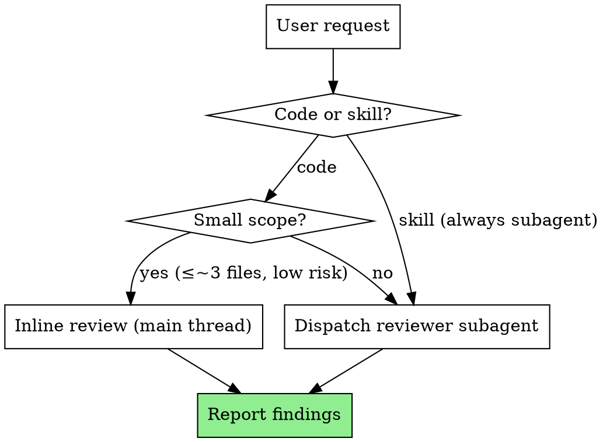

# rime-review — Code & Skill Quality Review

A generic, spec-agnostic quality review skill. Applies to any project; the dimension framework's applicability (especially security items) is judged against the target project's threat model at review time, never pre-excluded.

## Modes

Two review targets, one dimension framework:

- **Code mode** — review a change (diff at a fixed point, whole branch) or whole files/modules against the code dimensions.
- **Skill mode** — review a skill file (SKILL.md, prompt template, or skill directory) against the skill dimensions.

## Entry Orchestration

### Code Mode

Three scopes, all sharing the same dimension framework:

- **Fixed-point diff** — changes between two commits (BASE...HEAD semantics). Generate the diff package with `scripts/diff-package BASE HEAD` from this skill's directory; it prints the unique file path it wrote. Use the recorded BASE (the commit before the change), never `HEAD~1` — `HEAD~1` silently drops all but the last commit of a multi-commit change.
- **Whole branch** — diff from the merge base (`git merge-base main HEAD`) to HEAD. Use `scripts/diff-package MERGE_BASE HEAD`.
- **Whole files / modules** — read the target files directly; no diff package needed.

### Skill Mode

Review a skill file or skill directory against the skill dimensions. The skill under review is read in full; no diff generation needed. Applies the same dimension framework (S1–S6) whether the skill is a standalone SKILL.md, a prompt template, or a multi-file skill directory.

## Execution Mechanics

The execution shape depends on review depth:

- **Small reviews** (≤ ~3 files, low-risk change, straightforward skill) run inline in the main thread — no subagent dispatch overhead.
- **Deep reviews** (multi-file, architectural, security-sensitive, or any skill review) dispatch a **named** reviewer subagent (Agent `name` parameter, e.g. `reviewer-code-N` or `reviewer-skill-N`). A named reviewer stays attached for re-review rounds via SendMessage.

**Review Cost Model & Model Selection**: the authoritative definitions live in rime-flow's [dispatch.md](../rime-flow/dispatch.md) ("Review Cost Model" and "Model Tiers" sections). rime-review follows them without restating them. Tiered re-review, reviewer residency, auxiliary review batching, and escalation rules all apply as defined there.

**Verdict contract**: severity calibration (Critical / Important / Minor / spec-mandated), per-finding confidence, file:line requirement, full-report discipline, and review discipline rules are defined in [reference/verdict-contract.md](reference/verdict-contract.md). Every review round produces findings in that contract's format.

**Dimensions**: the full dimension framework (code C0–C6, skill S1–S6) with check questions is defined in [reference/dimensions.md](reference/dimensions.md). The framework is generic — applicability of each check (especially security items) is judged against the target project's threat model at review time, never pre-excluded.

## Boundaries

rime-review is one of three review mechanisms in the ecosystem; each owns a distinct axis:

| Mechanism | Axis it owns |
| --------- | ------------ |
| **rime-review** (this skill) | Necessity, architecture, robustness, security, skill review, ecosystem rules — spec-agnostic quality |
| **External code-review skill** (mattpocock / official plugin) | Standards (naming conventions, code style, code-smell taxonomy) — when the target project has a documented coding standard |
| **rime-sdd task reviewer** | Spec compliance (missing / extra / misunderstood — three-way comparison against the originating spec) |

- Pure naming, style, or code-smell questions → point to the external **code-review** skill's Standards axis; do not run rime-review for them.
- Spec-compliance review (does the code match what the spec asked for?) → belongs to the **rime-sdd task reviewer**, not rime-review.
- rime-review is **spec-agnostic**: it judges code quality on its merits, never against an originating spec.

## Workflow

1. Identify the review target (diff range, branch, file list, or skill path).
2. For code diffs: run `scripts/diff-package BASE HEAD` from this skill's directory; read the printed path.
3. Select execution shape (inline or subagent) per the Execution Mechanics above.
4. Apply the dimension framework from [reference/dimensions.md](reference/dimensions.md).
5. Produce findings per [reference/verdict-contract.md](reference/verdict-contract.md): severity, confidence, file:line, why it matters.
6. Report findings to the user (inline) or return the full report (subagent).
